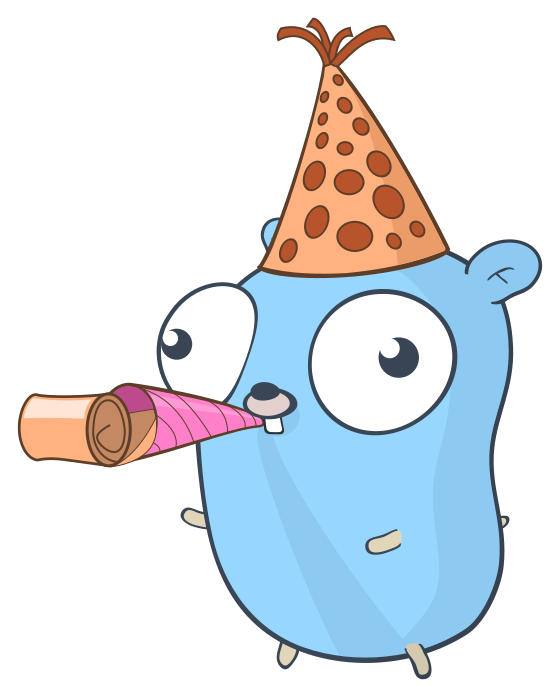

# About

Find us on [Github](https://github.com/sevenautumns/niketsu/).

## Project

The niketsu project was made with the customers (you) in mind to create the greatest of experiences for video synchronisation.

As an open source project, we strive to tear down barriers of not watching together.

We believe that everyone deserves to [insert motivational text that is included in every About Website].

Follow us on social media, leave a like and do not forget to activate the clock. Share this video with friends and family, offer a kidney to support us and make us rich. 

You can find us on every useful social media platform that does not suck ([Github](https://github.com/sevenautumns/niketsu/tree/main)).

## Images

Please support [egonelbre](https://github.com/egonelbre/gophers) for his great, free Gopher vector graphics and gifs.

