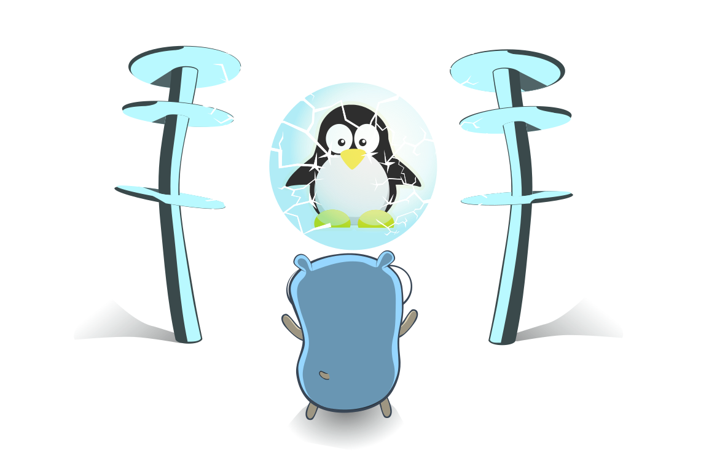

# Building

## Docker image 

Who uses docker anyway?


But in case you care, there is a Dockerfile available for the server.

To build the docker image with default values, use the following command:

```bash
podman build -t niketsu-server:latest .
```

(or use `docker` if you must)

To run the container, use the following command:

```bash
podman run -p 7766:7666 niketsu-server:latest
```

If you are interested in building a `docker-compose` file, consider the environment variables described in the [usage page](usage.md#Arguments).


##  Building from source 

### client

To build the niketsu client from source, clone the repo:

```bash
git clone https://github.com/sevenautumns/niketsu.git
cd niketsu
```

And use the build tools of Rust:

```bash
cargo build --release
./niketsu-server
```

### server

To build the niketsu server from source, clone the repo:

```bash
git clone https://github.com/sevenautumns/niketsu.git
cd niketsu
```

And use the build tools of Go:

```bash
go build -o niketsu-server server/main.go
./niketsu-server
```

## nix

<div align="center">



You know if you know.

</div>


### Development

Install the almighty [Nix](https://nixos.wiki/wiki/Nix_Installation_Guide), clone the repository and run:

```bash
nix develop
```

All dependencies for the client and the server are now included in the dev-shell.


### Building

In addition, client and server can be built with the the `flake.nix` file in the root directory of the repository.

#### client

```bash
nix build .#niketsu-client
```
#### server

```bash
nix build .#niketsu-server
```
