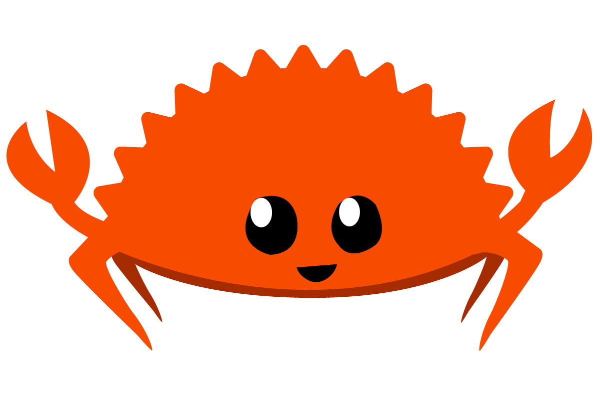

# Download

## Download links

Precompiled binaries (executable files) and [Source code](https://www.reddit.com/r/ProgrammerAnimemes/comments/k6k38v/chief_programmer_left_on_read/) are available here (or on [Github](https://github.com/sevenautumns/niketsu/releases)).

If you are interested to host a niketsu server yourself, feel free to use our binaries (below) or build it [yourself](./chapter_3.md).

### Client

- [x] [x86-64 Linux Release](https://github.com/sevenautumns/niketsu/releases/download/nightly/x86_64-linux-niketsu-client)
- [x] [ARM64 Linux Release (Raspberry Pi, etc.)](https://github.com/sevenautumns/niketsu/releases/download/nightly/aarch64-linux-niketsu-client)
- [x] [Fensterreinigung (Windows)](https://github.com/sevenautumns/niketsu/releases/download/nightly/x86_64-windows-niketsu-client.zip)
- [ ] A certain scientific fruit companies' systems

### Server

- [x] [x86-64 Linux Release](https://github.com/sevenautumns/niketsu/releases/download/nightly/x86_64-linux-niketsu-server)
- [x] [ARM64 Linux Release (Raspberry Pi, etc.)](https://github.com/sevenautumns/niketsu/releases/download/nightly/aarch64-linux-niketsu-server)

### Source

- [Source code (zip)](https://github.com/sevenautumns/niketsu/archive/refs/tags/nightly.zip) or [Source code (tar.gz)](https://github.com/sevenautumns/niketsu/archive/refs/tags/nightly.tar.gz)

## Author's Note

This software has been thoroughly investigated by a group of Gophers.
Be careful though, the Gophers are crazy.
And infested by some Ferris companions.

In case of inconsistencies, please report [here](https://github.com/sevenautumns/niketsu/issues) and open up and issue.

If it is deteced by some Malware program to be malicious, feel free to blame Ferris.

Please check the code if you feel uncertain: [Github](https://github.com/sevenautumns/niketsu)

