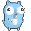
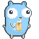

# News 

For nightly updates, check [GitHub](https://github.com/sevenautumns/niketsu/releases).

## Latest Updates 

- bbolt database in backend (still thinking about this)
- Added rooms (somewhat stable)
- TLS and password protection on server

## Current Development 

- Predictive and dynamic synchronization based on client caches
- Client-side convenience and settings
- Add docker image to the GitHub registry https://ghcr.io
- apply clean code practices
  - refactor
  - add tests

## Changelog 

Maybe in a far away future.

