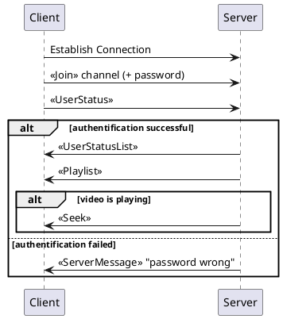
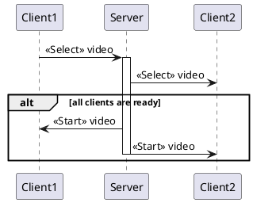
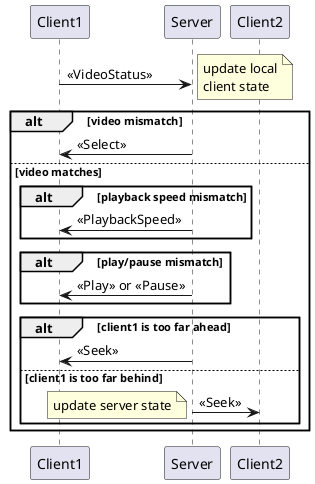

# Protocol

## Login

```plantuml,format=svg
@startuml
participant Client
participant Server
Client -> Server : Establish Connection
Client -> Server : <<Join>> channel (+ password)
Client -> Server : <<UserStatus>>
alt authentification successful
  Client <- Server : <<UserStatusList>>
  Client <- Server : <<Playlist>>
  alt video is playing
    Client <- Server : <<Seek>>
  end
else authentification failed
  Client <- Server : <<ServerMessage>> "password wrong"
end
@enduml
```

## Select Video

```plantuml,format=svg
@startuml
participant Client1
participant Server
participant Client2

Client1 -> Server : <<Select>> video
activate Server
Server -> Client2 : <<Select>> video
alt all clients are ready
  Client1 <- Server: <<Start>> video
  Server -> Client2: <<Start>> video
  deactivate Server
end
@enduml
```

## VideoStatus

```plantuml,format=svg
@startuml
participant Client1
participant Server
participant Client2

Client1 -> Server : <<VideoStatus>>
note right
  update local
  client state
end note
alt video mismatch
  Client1 <- Server: <<Select>>
else video matches
  alt playback speed mismatch
    Client1 <- Server: <<PlaybackSpeed>>
  end alt
  alt play/pause mismatch
    Client1 <- Server: <<Play>> or <<Pause>>
  end alt
  alt client1 is too far ahead
    Client1 <- Server: <<Seek>>
  else client1 is too far behind
    Server -> Client2: <<Seek>>
    note left
      update server state
    end note
  end
end
@enduml
```
