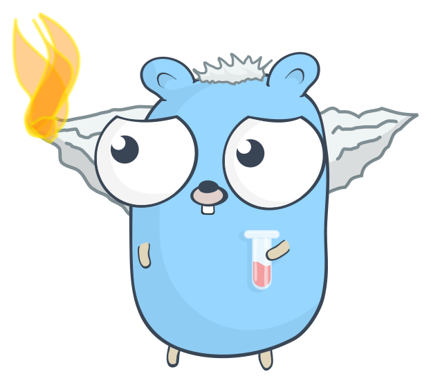

# Support

We care about you, so should you.

If there are any issues, our dev team is gladly of help and directly on your case.

Just open up an [issue](https://github.com/sevenautumns/niketsu/issues) or contact the devs on github or something.

Here is a representation of our devs furiously trying to fix your issues:

