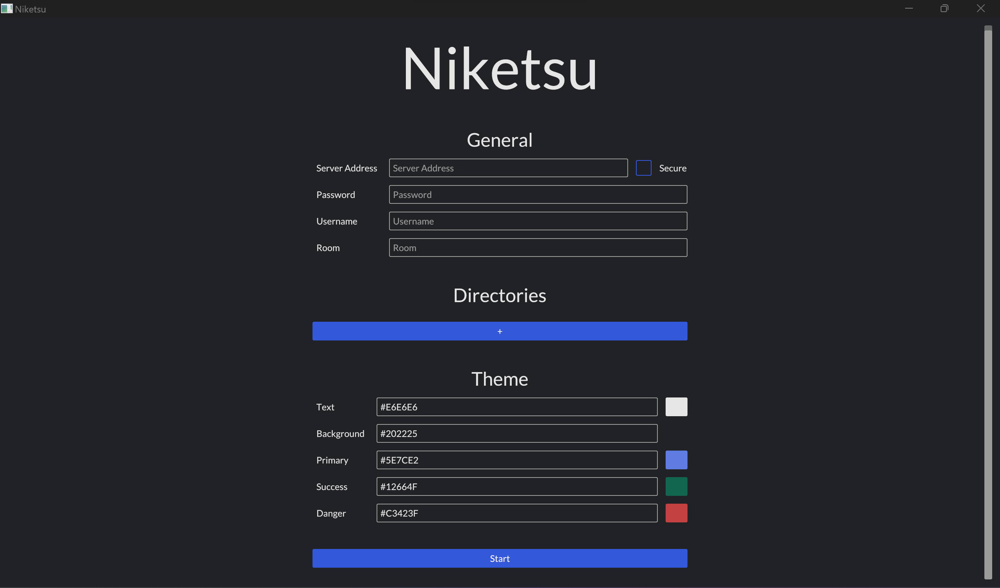
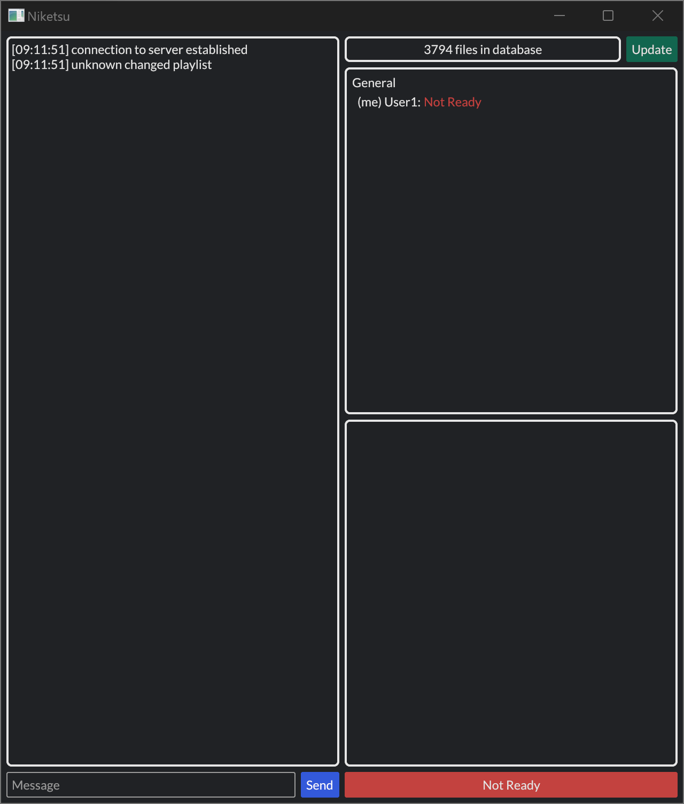

# Usage

## Getting started

<div>

This might be you right now.


Do not worry, we provide some documentation here.

</div>


### Client

#### Requirements

As of yet, the client is not statically (but dynamically) linked. Thus, the following program needs to be installed:

- [mpv](https://mpv.io/installation/)

#### Introduction

The latest version of the `niketsu-client` greets the user with the following startup GUI:



The `niketsu-client` can be used to synchronously watch videos with multiple users. Events of the media player such as starts, stops, seeks or positions and playback speeds are synchronized between clients according to the protocol of the server. Typically, the "slowest client wins". 

Sources of videos can either be any online source (such as youtube) that is supported by [mpv](https://mpv.io) or offline sources (local videos on your hard drives or network drives).

Note that at the moment all clients need to have the exact same names for the sources.

In the following, we will explain the general usage of the client and the arguments.

Note that arguments are saved from the previous session. Hence, you do not need to specify them each recurrent login.

In the near future, more options may be added or the GUI might change. In that case this page will be updated accordingly.


#### General

##### Sever Address

The server address should include a host name (either IP or domain) followed by a colon (:) and a port (range from 0 to 65,535).

Make sure to check the secure check button if the server supports a secure connection (TLS). If the secure button is checked incorrectly and does not reflect the settings of the server, the connection attempt will fail.

Example: autumnal.de:7766

where autumnal.de is the host and 7766 the port.

##### Password

In case the server you are trying to connect to has set a password, the client has to input it in the corresponding box.

If the server has not set a password, any password of the client is accepted.

Note: keep in mind that the password (and other messages) is sent unencrypted if the server is not secure.

Example: 1234

##### Username

The username that will be displayed to identify you on the server and is available to other users.

In the future, unique usernames will be enforced and names may potentially be changed ad hoc by the server.

Example: xXWeebLordXx

##### Room

The initial room that the client will join.

If the room does not exist before joining, it will be automatically created with an empty state.

Do not worry, you can still change rooms afterwards.

Example: animeIs4Weebs

#### Directories

Click the "+"-Button to add a directory. Multiple directories may be added or (in hindsight) deleted by clicking on the "-"-button.

Directories and all their subdirectories are searched and all video files are appended to a local database.

Once a connection to a server is established, the files from the directories may be added to the client to be watched together with other users.

Note that if multiple video files have the same name, only one of them is added to the database. This behaviour may change in the future.

Example: ~/videos/

#### Theme

You can customize the client according to your preferences. The color of each element of the GUI can be changed with the corresponding hex code.

If you do not know about hex codes, check out the following web page to choose colors and their corresponding hex code: (https://www.color-hex.com/)[https://www.color-hex.com/]

#### Video Player (MPV)

Finally, after all arguments are set in the client and the "Start"-Button at the bottom is pressed, a connection to the server is established.

Afterwards, two separate windows will pop up; one for the client's GUI and one for the video player ([mpv](https://mpv.io)).

If anything went wrong, check out the chat box on the left side of the client's GUI whether a connection could be established. If the connection failed, close the GUI and re-open the program and check the server address, the secure button and the password for correctness.

##### GUI description

After logging in, the GUI should look like this (two separate windows):

<div>


</div>

Currently, the media player mpv is unchanged. If you are familiar with mpv, you may enjoy `niketsu` out of the box.

Otherwise if you are unfamiliar with mpv, check out their [manual on controls and keybindings](https://mpv.io/manual/stable/#keyboard-control).

Apart from user specific settings for mpv (such as volume, fonts, brightness, etc.), the most relevant events and options for playback (such as start, stop, seek, position, etc.) are synchronized between `niketsu-clients` in the same room.

###### Chat

The left side of the client's GUI contains a chat box. Server messages for events are sent to this box to inform the user of what is going on, e.g. if a connection is dropped, a position is seeked, etc.

Additionally, users may communicate via this chat by sending messages typed in the box at the bottom left.

###### Video file database

At the top right of the GUI, there is loading bar with an "Update"-button. Inside the loading bar, the number of files found in the given directories (see [above](./usage.md#directories)) is shown. Directories are scanned once at login. If the underlying file system changes, press the "Update"-button to refresh the database.

###### Room overview

Below the file database, a box with all available rooms and logged in users is shown.

At the top-level, room names are shown and users logged into a room are slightly indented and ordered below that room.

At the moment, the ready state of each user is displayed. Further information may be added in the future.

By double-clicking on a room, the room a user is logged into may be changed.

###### Playlist

At the bottom right, the playlist of the current room is shown.

At the moment, videos may be added to the playlist by either copying and pasting or by inserting the files from a file browser.

The currently playing video is indicated by a preceding ">" before the video. If a video (non-url) could not be found in the local database, the background of the video in the playlist is red.

Each room has a separate playlist and separate synchronization.


### Server

If you are interested in hosting an instance of the `niketsu-server` yourself, check out the [building page](./building.md) or download the [precompiled binaries](./downloads.md).

Typically, the default options should suffice. However, if you are interested, the different configuration options of the server are discussed here.

#### Arguments

The configuration may be given in a config file, via the command line or via environment variables.

The order of precedence is: config file -> environment variable -> command line arguments.

Thus, if a config file has defined a value for an argument, this will be overwritten by both the corresponding environment variable or the command line argument.

The following arguments are currently supported. Keep in mind that depending on which method is used, these arguments might have a different constellation of upper- and lowercase letters.

##### HOST

Host address (e.g. IP, domain) without the port. If none is given, listens on all IPs of the host server.

Default: none

##### PASSWORD

Password needed for clients to access the server.

Default: none

##### PORT

Port on which the server listens on websocket connections.

Default: 7766

##### KEY

Path to key file for TLS. If none is given, cannot use TLS.

Default: none

##### CERT

Path to certificate file for TLS. If none is given, cannot use TLS.

Default: none

##### DBPATH

Path to where the databases are saved.

Default: .db

##### DBSTATINTERVAL

Time interval (in seconds) that determines how often statistics of the database are logged. Might be changed in the future.

Default: 120

##### DBUPDATEINTERVAL

Time interval (in seconds) that determines how often the databases are written to files. Avoids excessive writing. Might be changed in the future.

Default: 2


##### DBWAITTIMEOUT

Time (in seconds) that determines how long a database client will wait when the database is locked before timeouting. Might be changed in the future.

Default: 4


##### DEBUG

Whether to use debug logging.

Default: false


#### Config file

The config file should be in toml format.

In the github repository you can find a [default config toml](https://github.com/sevenautumns/niketsu/blob/main/server/config.toml):

```toml
title = "Server Configuration"

[General]
Host = "0.0.0.0"
Port = 7766
DBPath = ".db/"
Debug = true
# Cert = "cert.pem"
# Key = "key.pem"
# Password = "1234"
# DbUpdateInterval = 2
# DbWaitTimeout = 4
# DbStatInterval = 120

[Rooms]
[Rooms.General]
Persistent = true

[Rooms.Test]
Persistent = true
```

Make sure to use the correct upper- and lowercase letters for the arguments and follow the structure of the default toml file. Conveniently, just copy the file from the repository and change the arguments as you see fit.

If arguments are not defined, incorrectly spelled or, for example as hash tag is prepended, the arguments are ignored and default values will be used instead.

Under the tag `[General]` all of the server arguments (see [above](./usage.md#arguments)) may be defined.

In addition, the tag `[Rooms]` may be added with additional pre-defined rooms. Rooms can be created with additional tags starting with `Rooms.` followed by their name, e.g. `[Rooms.General]` will create a room called `General` on the server.
At the moment, rooms only use one additional setting `Persistent` which is either `true` or `false` (default) which determines if rooms will persist on the server even if they are no longer used. This behaviour might change in the future.


#### Command line

In addition to the config file, each of the arguments can also be given via the command line interface.

To get a list of all arguments, simply add `--help` to the program call.

Arguments are fully lowercase. A config file may be specified by setting the `--config` argument.

#### Environment variables

Finally, each of the arguments (see [above](./usage.md#arguments)) can set set via environment variables.

Environment variables precede config arguments and may overwrite them. However, command line arguments hold the highest priority.

Depending on future changes, all arguments and variables are subject to change.
