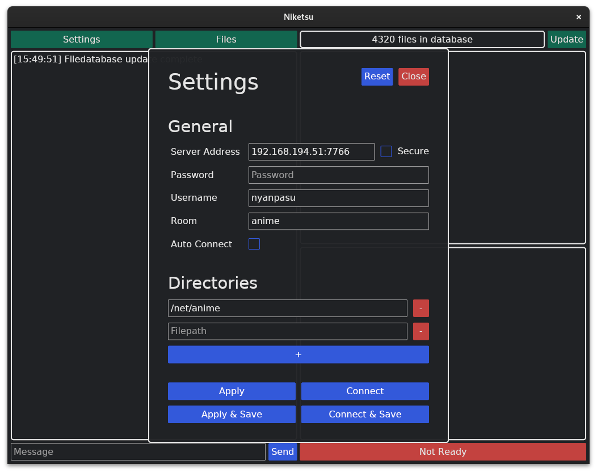
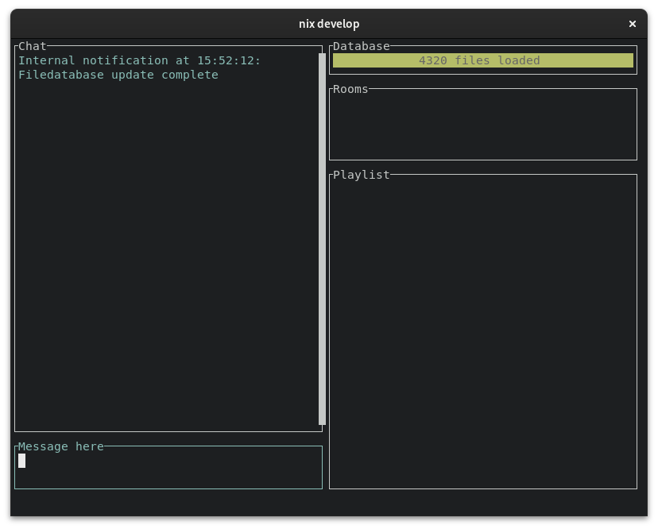

# Usage Guide 🚀

## Bootstrapping Your Journey 🛠️

Just landed? Here's the 411 on how to get your `niketsu-client` game on point.

### The Client-Side of Things 👨‍💻

#### Pre-requisites

- [mpv](https://mpv.io/installation/): Yup, it's dynamically linked, not static. Make sure you've got this bad boy installed.

#### The Grand Entrance 🌟

After installing, you're greeted by this UI:

Use `niketsu-client` to binge content in real-time with your crew. Whether you're into YouTube or good ol' offline videos, we got you covered. Just make sure the source names match across clients. Server logic is "slowest client wins," so no lag-advantage here.

#### Let's Dive Deep 🌊

##### Server Address 🏠
Host:Port format. If you're on HTTPS, don't forget to toggle that secure button.  
Example: `autumnal.de:7766`

##### Password 🗝️
Server-set password? Input it. No password? We're chill either way.
Example: `1234secure`

##### Username 🎭
This is how you'll show up in the matrix.  
Example: `tech-savy gopher`

##### Room 🚪
Your landing zone. Auto-creates if doesn't exist.
Example: `spaceship`

#### Filesystem 📂
Add/delete directories via "+" and "-" buttons.  
Example: `~/videos/`

#### Other options
Set auto-login to directly dive into your adventure without a boring login screen.
The save buttons will apply your login data and save it for future calls.

#### Video Time 🎬
Hit "Start," connect, and enjoy dual-window magic with [mpv](https://mpv.io).

#### Got Issues? 🐛
Debug through the chat box.

##### What's on the GUI? 🖼️

- **Chat Box**: Left side, for system and user messages.
- **File Database**: Top-right, update when your file system changes.
- **Room Overview**: Shows who's in what room.
- **Playlist**: Bottom-right. Syncs based on the room you're in.

##### New Additions 🆕
- **Settings**: Top-left corner.
- **File Search**: Beside Settings, for quicker video additions.

##### Terminal Junkies 🤓
Opt for our Text-based UI. Keybindings? `space + h`.

### The Server-Side Saga 🖥️

For the DIY gods, check out [building page](./building.md) or snag our [precompiled binaries](./downloads.md).

#### Customizing Your Realm 🌍

Configurations can be set via JSON, CLI, or ENV variables, in that precedence order. Explore the GitHub repo for a [sample config](https://github.com/sevenautumns/niketsu/blob/main/server/config.json).

##### Parameters 📋
- **HOST**: Where your server listens.
- **PASSWORD**: Gateway for clients.
- **PORT**: 7766 by default.
- **KEY**: For TLS.
- **CERT**: Ditto.
- **DBPATH**: `.db` default.
- **DBUPDATEINTERVAL**: Database write interval.
- **DBWAITTIMEOUT**: DB lock timeout.
- **DEBUG**: For extra logs.

#### CLI & ENV Vars 🖋️
Invoke with `--help` for CLI args. ENV vars work too, but CLI trumps all.

Stay updated, we're always in flux. 🔄
