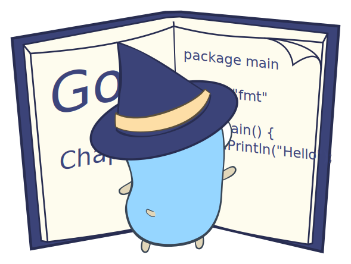
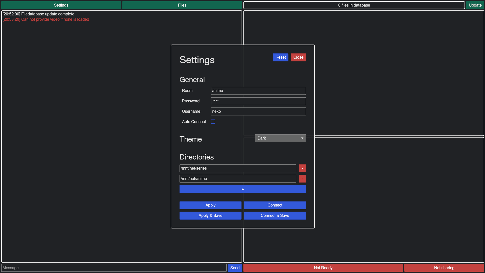
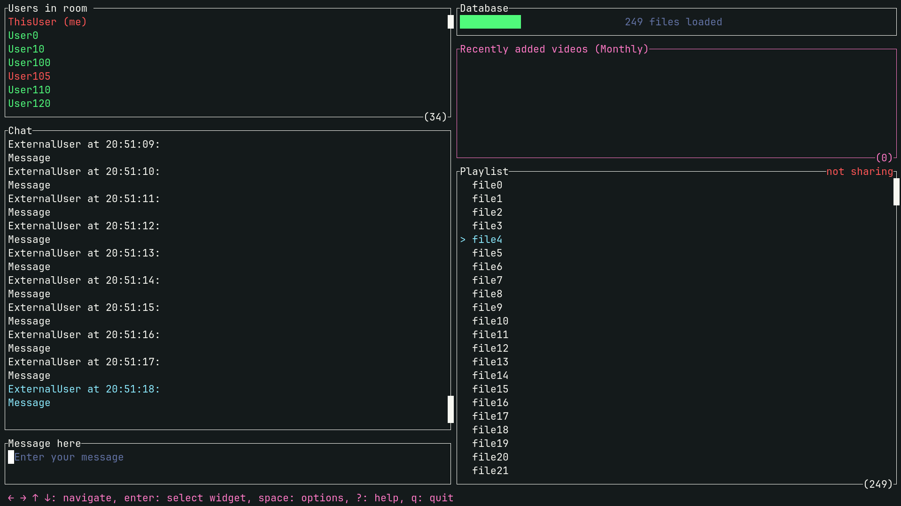

# Usage Guide 🚀

## Bootstrapping Your Journey 🛠️



Just landed? Here's the 411 on how to get your `niketsu-client` game on point.

### The Client-Side of Things 👨‍💻

#### Pre-requisites

- [mpv](https://mpv.io/installation/): Yup, it's dynamically linked, not static. Make sure you've got this bad boy installed.

#### The Grand Entrance 🌟

After installing, you're greeted by this UI:



Use `niketsu-client` to binge content in real-time with your crew. Whether you're into YouTube or good ol' offline videos, we got you covered. Just make sure the source names match across clients. Server logic is "slowest client wins," so no lag-advantage here.

#### Let's Dive Deep 🌊

Most parameters are now moved to the configuration file, typically found at `~/.config/niketsu/config.toml`:

```toml
username = "karl"
media_dirs = ["/mnt/point"]
room = "someverylongroomname"
password = "1234"
auto_connect = false
auto_share = false
relay = "autumnal.de"
port = 7766
```

#### Other options
Set auto-login (`auto_connect = true`) to directly dive into your adventure without a boring login screen.
The save buttons will apply your login data and save it for future calls.

Set auto-share (`auto_share = true`) to continue sharing videos even if a new video is selected. This does not overwrite video sharing inside the application.

If you host your own relay server, make sure to set `relay` to the IP/domain of your relay and `port` to the corresponding port of the service.

#### Video Time 🎬
Hit "Start," connect, and enjoy dual-window magic with [mpv](https://mpv.io).

#### Got Issues? 🐛
Debug through the chat box.

##### What's on the GUI? 🖼️

- **Chat Box**: Left side, for system and user messages.
- **File Database**: Top-right, update when your file system changes.
- **Room Overview**: Shows who's in what room.
- **Playlist**: Bottom-right. Syncs based on the room you're in.

##### New Additions 🆕
- **Settings**: Top-left corner.
- **File Search**: Beside Settings, for quicker video additions.


#### Terminal Junkies 🤓
Opt for our text-based UI using `--ui ratatui`. Keybindings? Checkout the bottom row or press `?`/`space + h`.

Simple and intuitive design.



### The Server-Side Saga 🖥️

You can host your own relay server, so connections are not made via our external relay hosted at autumnal.de.

Do not forget to update your `~/.config/niketsu/config.toml` in your clients to direct traffic to your domain.

For the DIY gods, check out [building page](./building.md) or snag our [precompiled binaries](./downloads.md).

#### Customizing Your Realm 🌍

Configurations can be set via toml or cli found at .`~/.config/niketsu-relay/config.toml` if available.

##### Parameters 📋
```toml
ipv6 = true
keypair = [] # byte array of ed25519 private key
port = 7766
```

If `keypair` is not set, it will be randomly generated. This is required for the relay to obtain a peer id. Its only purpose is to uniquely identify the relay.


<br>
<hr>

**Stay updated, we're always in flux.** 🔄
